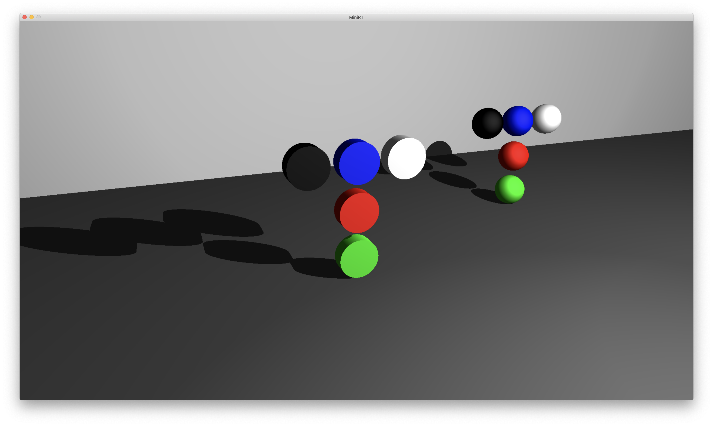
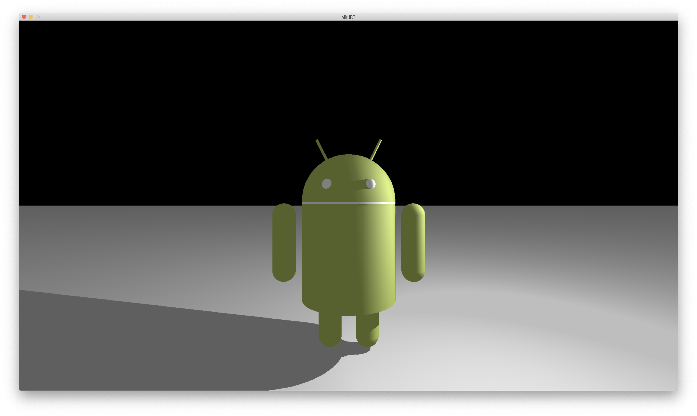
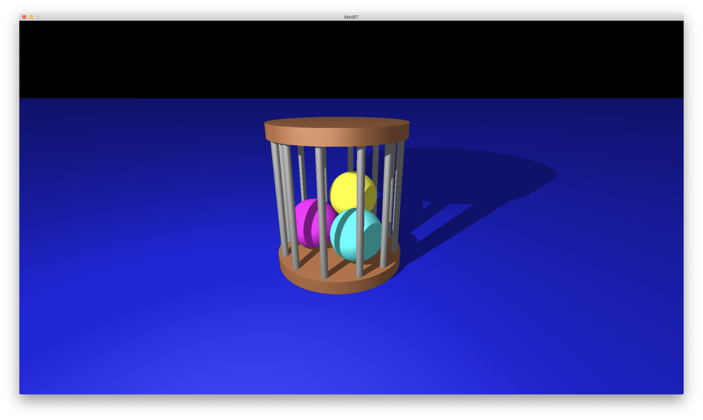
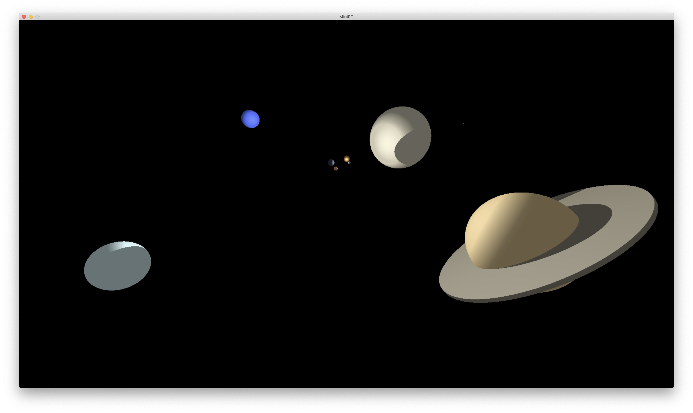
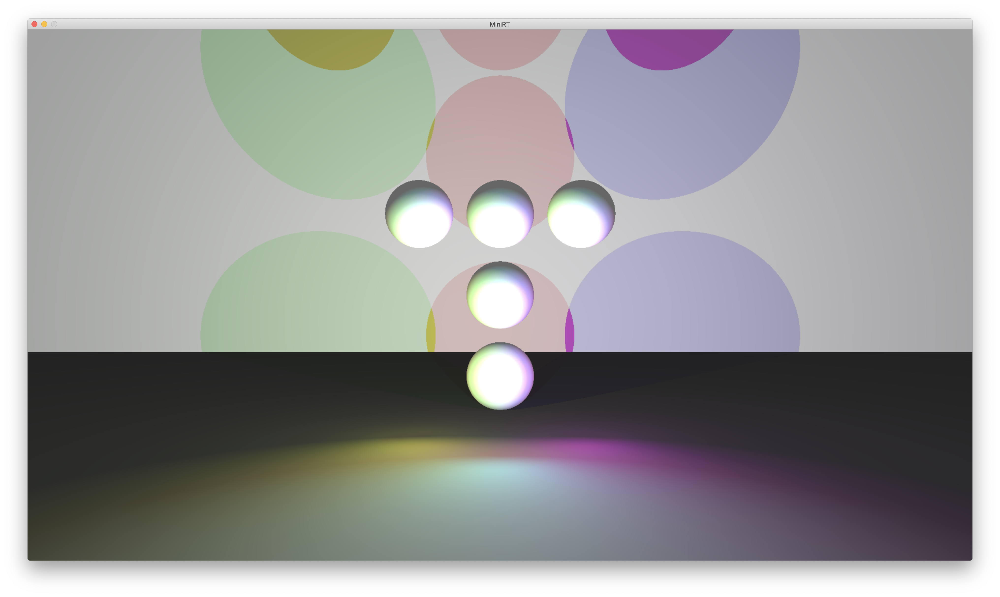

# miniRT
This program recieves a `.rt` formatted file which contains a series of objects (`A`mbient light, `C`amera, `L`ights, `sp`heres, `pl`anes, `cy`linders and `b`lack `h`oles [bonus only]) and must display them as specified on a new window.
Every object must be set on a different line in the input file. Each type of object must have its own format:

 ## File formatting by objects
### Ambient light
> (Only one Ambient light is required)
>- `A {brightness} {color}`
>- Example: `A 0.2 255,255,255`

### Camera
>(Only one Camera is required)
>- `C {location} {orientation} {fov}`
>- Example: `C -50.0,0,20 0,0,1 70`

### Light
>(At least one Ambient light is required. Bonus allows to set multiple lights)
>- `L {location} {brightness} {color (bonus only)}`
>- Example: `L -40.0,50.0,0.0 0.6 10,0,255`

### Sphere
>- `sp {location} {diameter} {color}`
>- Example: `sp 0.0,0.0,20.6 12.6 10,0,255`
### Plane
>- `pl {location} {normal_vector} {color}`
>- Example: `pl 0.0,0.0,-10.0 0.0,1.0,0.0 0,0,225`
### Cylinder
>- `cy {location} {orientation} {diameter} {height} {color}`
>- Example: `cy 50.0,0.0,-20.6 0.0,-0.5,1.0 14.2 21.42 10,0,255`
### Black hole
>(Bonus only)
>- `bh {location}`
>- Example: `bh -10.0,0.0,0.0`

## Scenes

## Gratitude
 * https://harm-smits.github.io/42docs/libs/minilibx.html | MiniLibX documentation
 * <b>Pol Sánchez Forns</b> | Assistance with the camera setup and cylinder managing.
